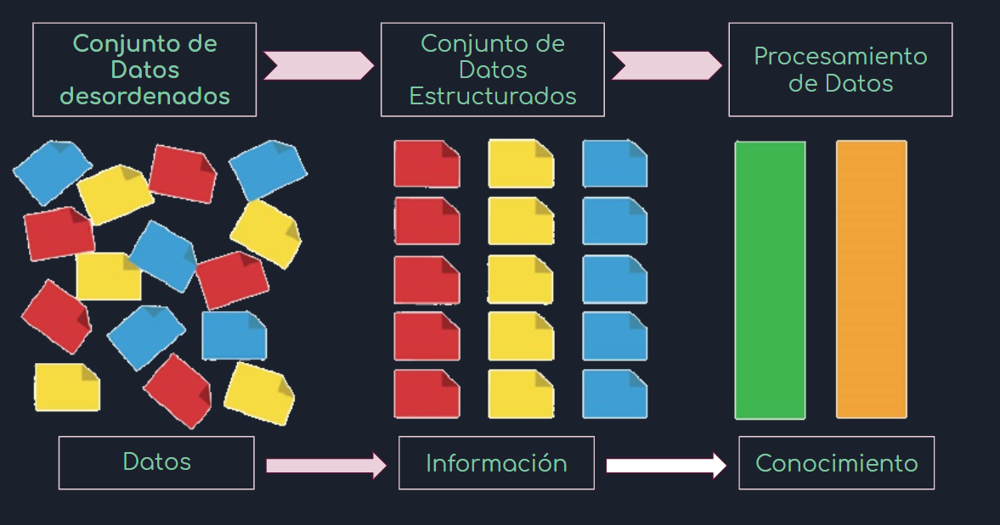

<style>
body {
text-align: justify}
}
</style>

# Transformación de los Datos



## Tipos de Bases de Datos

Existen diferentes tipos de bases de datos

* Estructuradas
* No Estructuradas

También existen diferentes tipos de formatos de bases de datos

* csv
* xlsx
* xml
* sql
* HDF
* NetCDF
* json
* dta
* sav
* jpeg
* png
* svg
* GML
* GPX
* GIS
* GeoJson

## Investigaciones

Para cualquier proyecto de investigación los pasos a seguir son:

* Objetivos
* Marco conceptual
* Recolección de información (encuestas, datos de internet, censos, etc.)
* **Estructuración de los datos**
* Análisis de datos/información
* Conclusiones/Recomendaciones
* Toma de decisiones

## Exportar e Importar Datos

Se puede importar datos de diferentes fuentes. Veremos las mas utilizadas:

Para este ejemplo se descargará una base de datos del sitio web <https://datos.gob.bo/> específicamente de los casos de la pandemia del  Covid 19 de Bolivia a nivel departamental <https://datos.gob.bo/dataset/casos-covid-19-acumulado-por-municipios>

```{r}
#Directorio de trabajo
getwd()
```

```{r}
#Cargar nuevo directorio de trabajo
#setwd("C:/Users/ACER/Documents/Proyectos/curso_rbasico/curso_rbasico/bd")
```

## csv Exportar/Importar

Los archivos csv (comma-separated values) valores separados por comas.

```{r}
#Importar
bd_covid<-read.csv("covid19mun_se.csv",encoding = "UTF-8")
```

```{r}
#Exportar
write.csv(bd_covid,"covid19mun.csv",sep = ",", fileEncoding = "UTF-8")
write.csv(bd_covid,"covid19mun.csv",sep = ",", fileEncoding = "UTF-8",row.names = FALSE)
```

```{r}
bd_covid<-read.table("covid19mun_se.csv",encoding = "UTF-8",sep = ",",header=TRUE)
```

## Excel Exportar/Importar

```{r}
#install.packages("readxl")
library(readxl)
```
```{r}
#install.packages("writexl")
library(writexl)
```

```{r}
#Exportar
write_xlsx(bd_covid,"covid19mun.xlsx")
```

```{r}
#Importar
bd_covid1<-read_xlsx("covid19mun.xlsx")
```


# Introducción a la libreria "dplyr"

El paquete `dplyr` de R, que fué desarrollado por Hadley Wickham y Romain Francois, como una optimización del paquete `plyr`.

Este paquete ofrece diferentes bondades en el manejo y administración de data frames en R, ya que simplifica muchas cosas desde la facilidad del código, una mejor funcionalidad y es mucho más rápido en su procesamiento, porque muchas de las operaciones están codificadas en C ++.

Las funciones principales del paquete son:

* `filter`: extrae/filtra un subconjunto de filas de un data frame basado en una condición lógica.
* `select`: retorna un subconjunto de columnas de un data frame.
* `group_by`: agrupa los datos en el data frame de acuerdo a las variables.
* `summarise`/`summarize`: genera estadísticas resumidas de diferentes variables.
* `arrange`: ordena las filas de un data frame en función de los valores de una o más columnas.
* `rename`: renombra variables en un data frame.
* `mutate`: añade nuevas variables/columnas o las transforma.
* `pipe %>%`: es un operador utilizado para conectar funciones. 

```{r}
#install.packages("dplyr")
library(dplyr)
```


# Funcionalidades de la libreria "dplyr"

```{r}
str(bd_covid)
```

```{r}
bd_covid
```

## rename

`rename`: renombra variables en un data frame.

```{r}
rename(bd_covid,depto=DEPARTAMENTO)
```

## filter

`filter`: extrae/filtra un subconjunto de filas de un data frame basado en una condición lógica.

```{r}
filter(bd_covid,DEPARTAMENTO=="LA PAZ")
```

## select

`select`: retorna un subconjunto de columnas de un data frame.

```{r}
select(bd_covid,DEPARTAMENTO,MUNICIPIO,CONFIRMADOS)
```

```{r}
select(bd_covid,DEPARTAMENTO:ACTIVOS,-Codigo)
```


## group_by

`group_by`: agrupa los datos en el data frame de acuerdo a las variables.

```{r}
group_by(bd_covid,DEPARTAMENTO)
```

## summarise

`summarise`/`summarize`: genera estadísticas resumidas de diferentes variables.

```{r}
gbd_covid<-group_by(bd_covid,DEPARTAMENTO)
summarise(gbd_covid,
          n_confirmados=n(),
          sum_confirmados=sum(CONFIRMADOS),
          media_confirmados=mean(CONFIRMADOS),
          sd_confirmados=sd(CONFIRMADOS))
```

## mutate

`mutate`: añade nuevas variables/columnas o las transforma.

```{r}
mutate(bd_covid,ajuste_confirmados=ACTIVOS+FALLECIDOS+RECUPERADOS...,
       verificacion=ifelse(CONFIRMADOS==ajuste_confirmados,"Si","No"))
```


## arrange

`arrange`: ordena las filas de un data frame en función de los valores de una o más columnas.

```{r}
arrange(bd_covid,MUNICIPIO)
```

```{r}
arrange(bd_covid,-SE)
```


## Operador "pipe"

`pipe %>%`: es un operador utilizado para conectar funciones. 

```{r}

```

